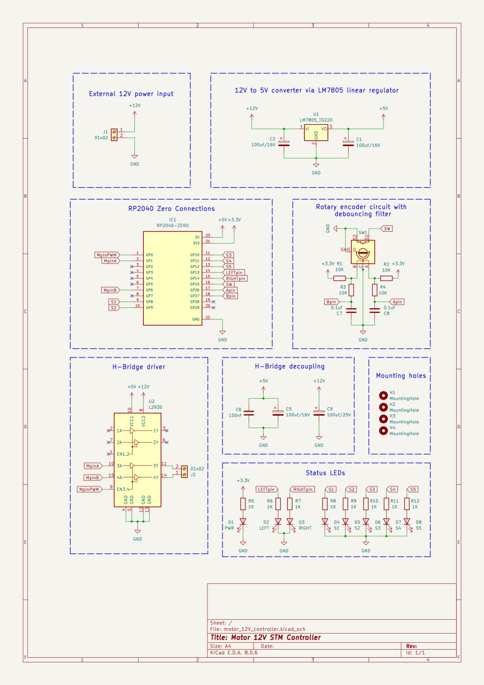
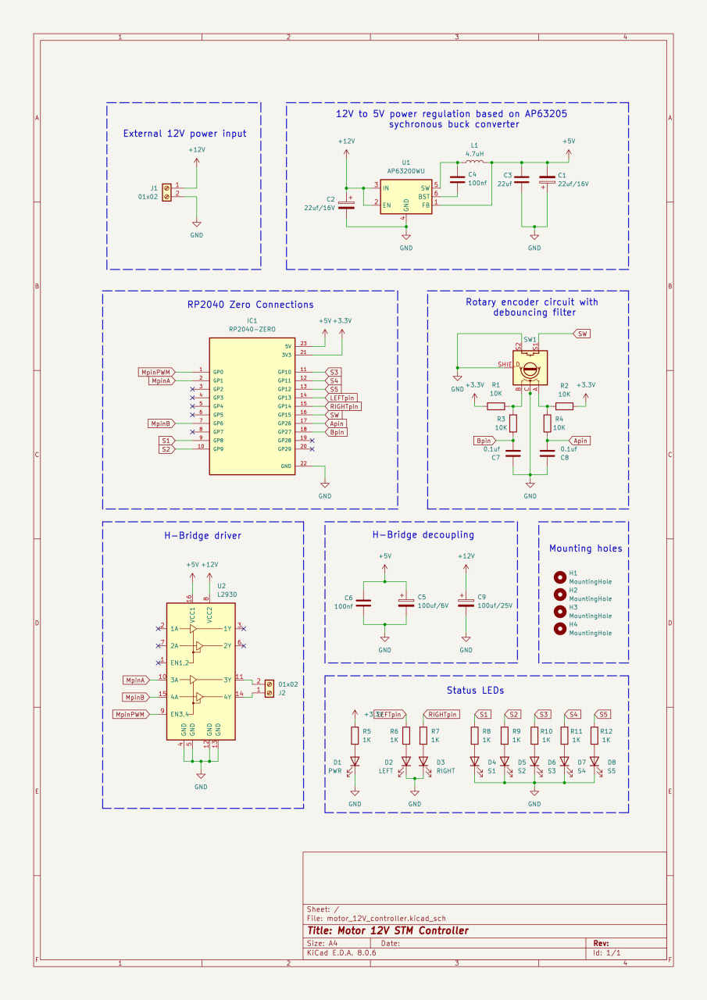
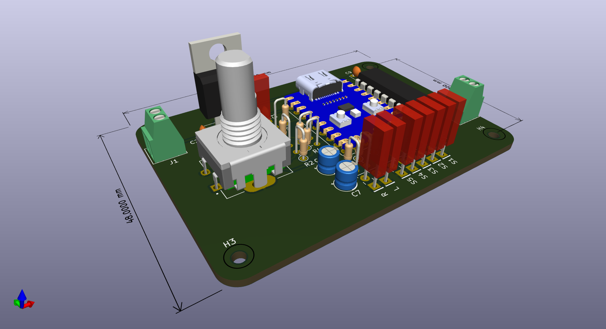
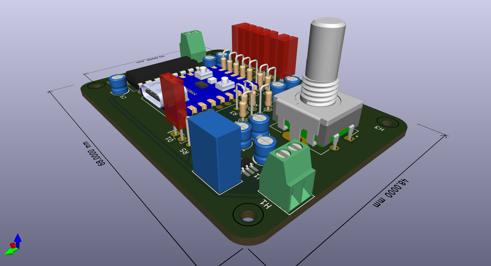
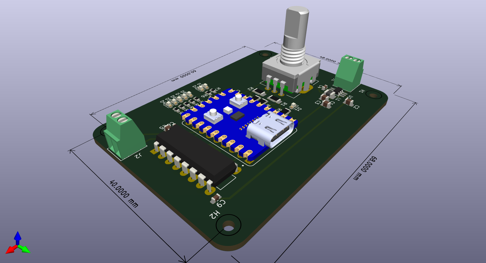

# RP2040-Zero Powered 12V Motor Controller

RP2040 microcontroller handles status LEDs, an H-Bridge driver, and a rotary encoder input. RP2040's **PIO** is used to read encoder signals as a state machine, completely restraining bouncing errors from the input lines. This allows to use cheap encoders and have an amazing precision.

---

---

### PCB
- Designed in **KiCad**.
- Screw terminals 12V power input and motor output.
- Two versions include buck converter and linear regulator.

---

## Software
1. **Rotary Encoder**:
   - PIO reads encoder signals and adjusts speed.
2. **Rotary Encoder's Switch**:
   - Changes motor direction via the H-Bridge.
3. **PWM**:
   - Controls motor speed by adjusting duty cycles.
4. **Status LEDs**:
   - Show real-time speed and direction updates.

---

### Requirements
- **Rust Toolchain**: For building firmware.
- **elf2uf2-rs**: To flash the RP2040 (`cargo run` automatically searches for connected rp2040 and flashes thefirmware).
- **KiCad**: adjust PCB design.

---

Provides a reference for PIO-based rotary encoder handling in Rust.

